# Lab Solution: AWS Cost Explorer and Cost Optimization

**Student Name:** Eric Rodrigues Borba  
**Date:** 24/04/2026  
**Lab Completion Time:** ___________ minutes

---

## Part 1: Cost Explorer Setup

### Screenshot 1: Cost Explorer Dashboard
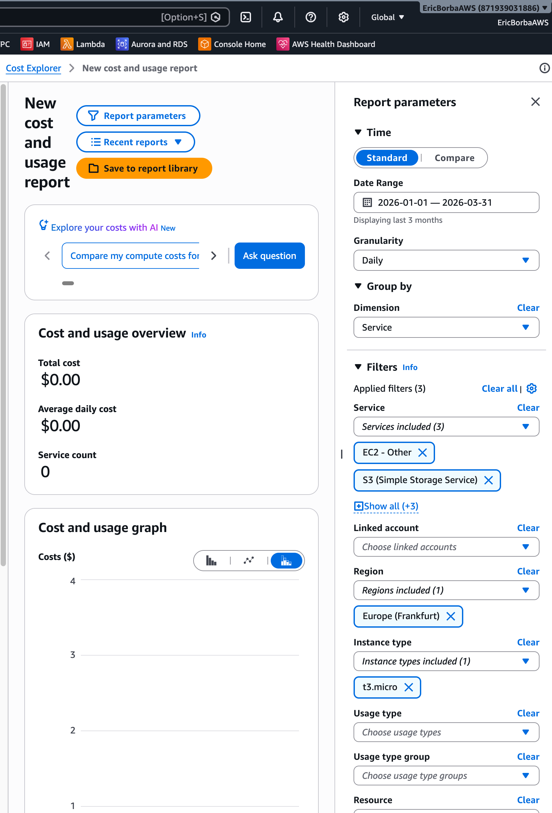

**Date Cost Explorer enabled (if new):** 
22/04/2026

**Account has usage history:** ☐ Yes x No (If no, practiced with interface)

---

## Part 2: Historical Spending Analysis

### 6-Month Cost Trends

**Screenshot 2: 6-Month Trend**
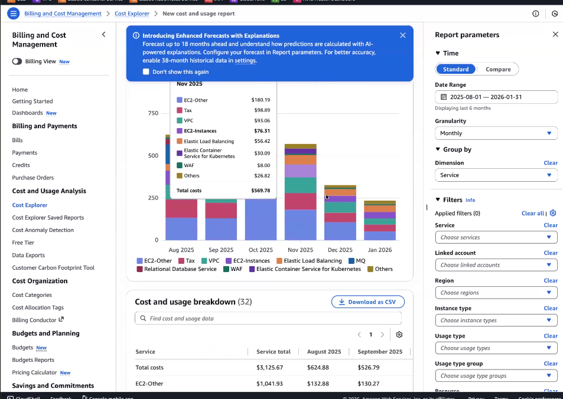

**Total spend (last 6 months):** $3.125,67

**Average monthly:** $520,945

**Highest month:** October, $ ~800 

**Reason for highest month:**
```
Service EC2 had high consumption and also resulted in higher taxes being paid.
```

---

### Daily Cost Analysis

**Screenshot 3: Daily Analysis**
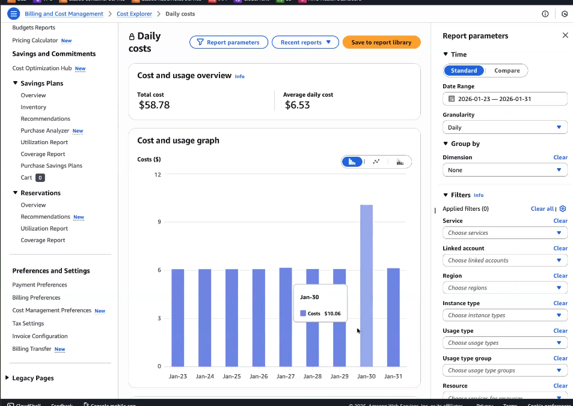

**Observations about daily patterns:**
```
The figure shows daily granularity, but not service-specific granularity. However, a clear pattern can be observed, except for Friday, January 30th, where a peak in demand can be seen.
```

---

## Part 3: Service-Level Analysis

### Top Cost Drivers

**Screenshot 4: Top Services**
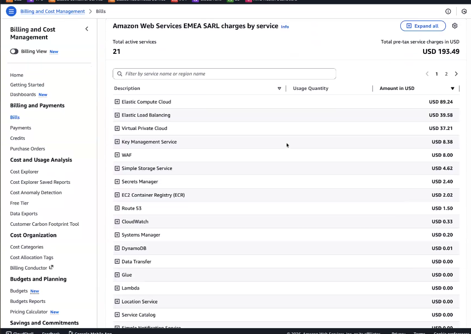

**Top 5 Services:**
1. Elastic Compute Cloud: $89,24
2. Elastic Load Balancing: $39,58
3. Virtual Private Cloud: $37,21
4. Key Management Service: $8,38
5. WAF: $8,00

---

### EC2 Cost Breakdown

**Screenshot 5: EC2 Breakdown**


**Most expensive instance type:** "No Instance Type" and the next one is "t3a.2xlarge"

**Total EC2 cost (last month):** $984,29
"Not exactly last month. I am using the information that was possible to obtain from the picture that was provived to us."
**Percentage of total bill:** 11,5%

**Usage type breakdown:**
- On-Demand: $820,00
- Reserved Instances: $90,00
- Spot Instances: $45,00
- Data Transfer: $29,29
"Many of the values ​​are fictitious because my CloudWatch dashboard is still empty (but enabled) and the images provided do not contain this information"
---

### S3 Cost Breakdown

**Screenshot 6: S3 Breakdown**


**Total S3 cost:** $4,62

**Storage cost:** $3,70

**Request cost:** $0,72

**Data transfer cost:** $0,00

**Storage breakdown by class:**
- Standard: $3,00
- Intelligent-Tiering: $0,5
- Glacier: $0,15
- Other: $0,05

"Many of the values ​​are fictitious because my CloudWatch dashboard is still empty (but enabled) and the images provided do not contain this information."
---

## Part 4: Advanced Filtering

### Cost by Region

**Screenshot 7: Regional Costs**
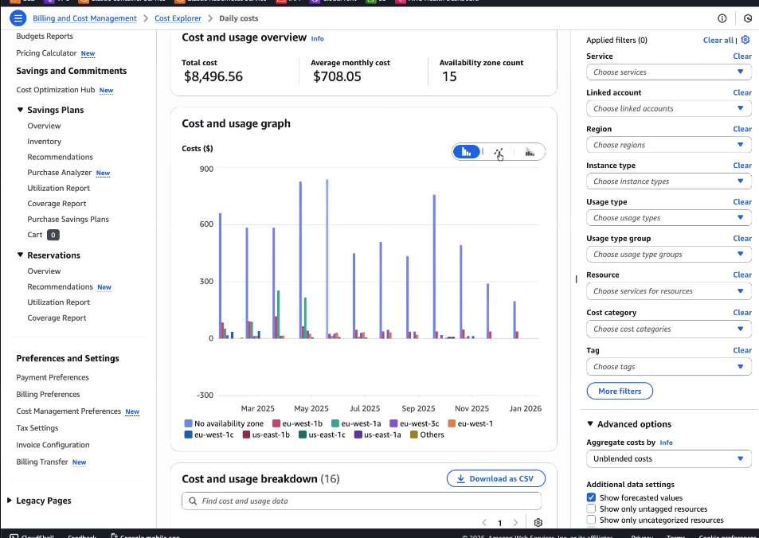

**Most expensive region:** "No availability zone" and "eu-west-1b" is the next.

**Cost:** $ "information not available in the provided picture"

**Are you using resources in regions you don't need?**
```
Yes — the chart shows active spend across at least 9 regions. If your workloads are primarily in one
region, consolidating could significantly reduce costs.
```

---

### Cost by Tag

**Screenshot 8: Cost by Tag**
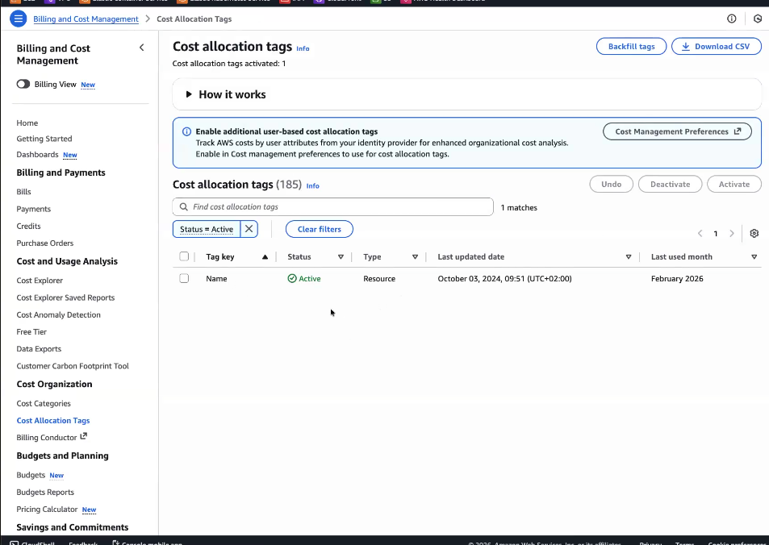

**Tags analyzed:** ☐ Environment ☐ Project ☐ Team x None available yet

**Cost breakdown by tag (if available):**
- Tag key: ___________________________
  - Value 1: Name, $_______________
  - Value 2: _______________, $_______________
  - Value 3: _______________, $_______________

---

## Part 5: Cost Allocation Tags

### Activated Tags

**Screenshot 9: Activated Tags**
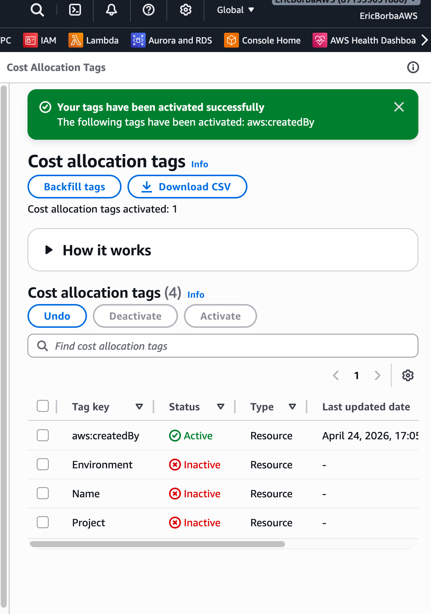

**AWS-Generated tags activated:**
- [x] aws:createdBy
- [ ] aws:cloudformation:stack-name
- [ ] Other: ___________________________

**Activation date:** 24/04/2026

---

### Tagging Strategy

**Screenshot 10: Tagged Resources**
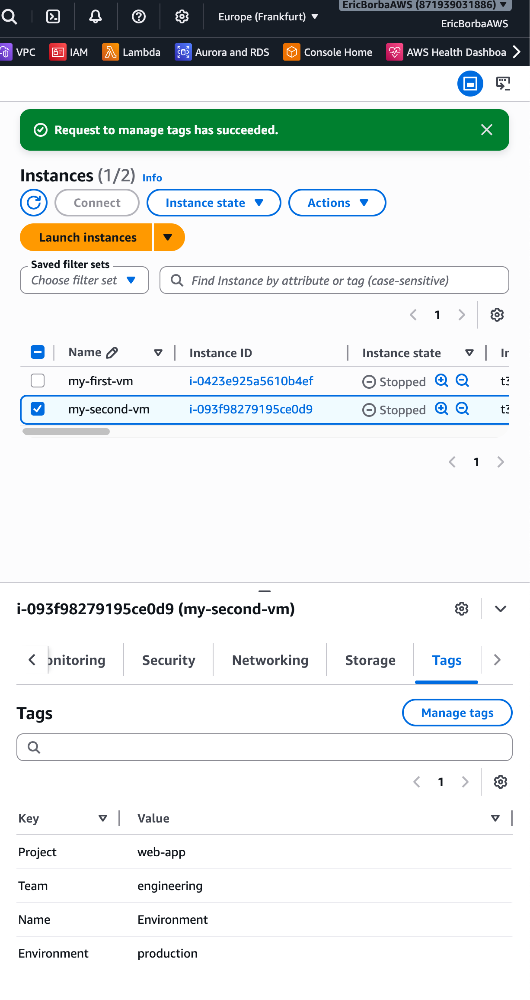

**Resources tagged:** my-second-vm (EC2)

**Tagging Plan:**

**Tag 1:**
- Key: Project
- Values: web-app, _______________, _______________
- Purpose: Identifies which project or product the resource belongs to, allowing cost allocation per project in billing reports.

**Tag 2:**
- Key: Team
- Values: engineering, _______________, _______________
- Purpose: Tracks which team owns and is responsible for the resource, enabling chargebacks or budgets per team.

**Tag 3:**
- Key: Environment
- Values: production, _______________, _______________
- Purpose: Distinguishes resources by deployment stage so you can compare spending across development, testing, and production.

**How will these tags help with cost management?**
```
They allow you to filter and group costs in AWS Cost Explorer by project, team, or environment. By doing so, it makes easy to see exactly where money is being spent.
```

---

## Part 6: Custom Reports

### Report 1: Monthly Service Cost Report

**Screenshot 11: Monthly Report**
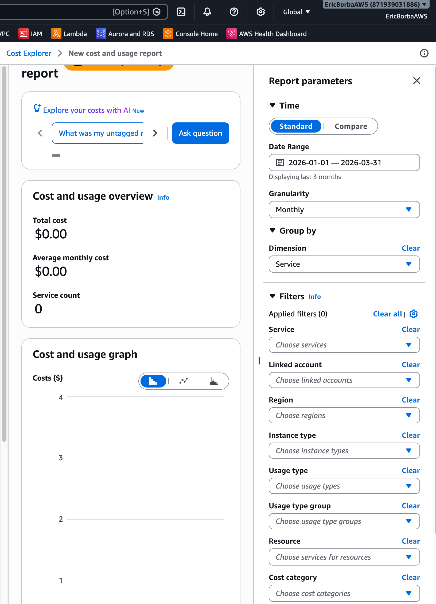

**Report configuration:**
- Date range: 3 months
- Granularity: Monthly
- Group by: Service
- Chart type: Bar

---

### Report 2: Top 10 Services

**Screenshot 12: Top Services Pie Chart**
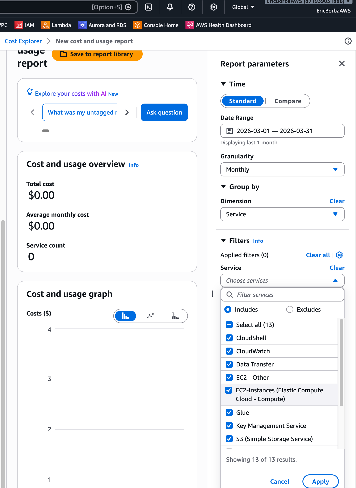

**Top 3 services from pie chart:**
1. ___________________________: _______%
2. ___________________________: _______%
3. ___________________________: _______%

"I don't have any costs being shown yet, but the image shows how it's possible to select the top results using the filter. AWS apparently doesn't allow pie charts."
---

### Report 3: Daily Cost Monitor

**Screenshot 13: Daily Monitor**
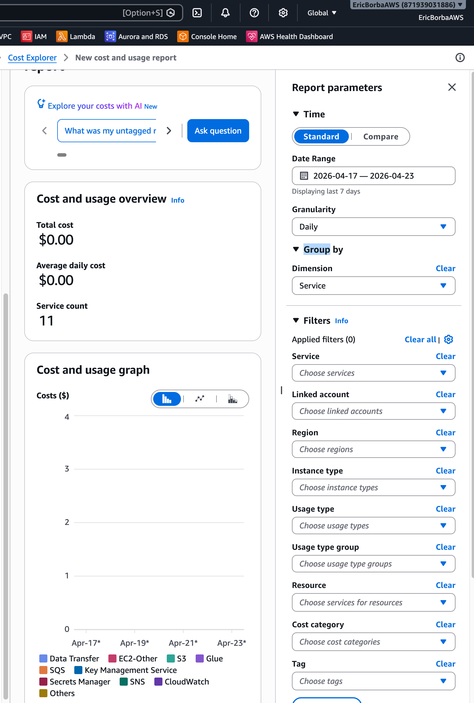

**How often will you review this report?**
```
1-2 times per week. Daily if cost-sensitive environments or high-risk sytems
```

---

## Part 7: Cost Anomaly Detection

### All Services Monitor

**Screenshot 14: Anomaly Detection Monitor**
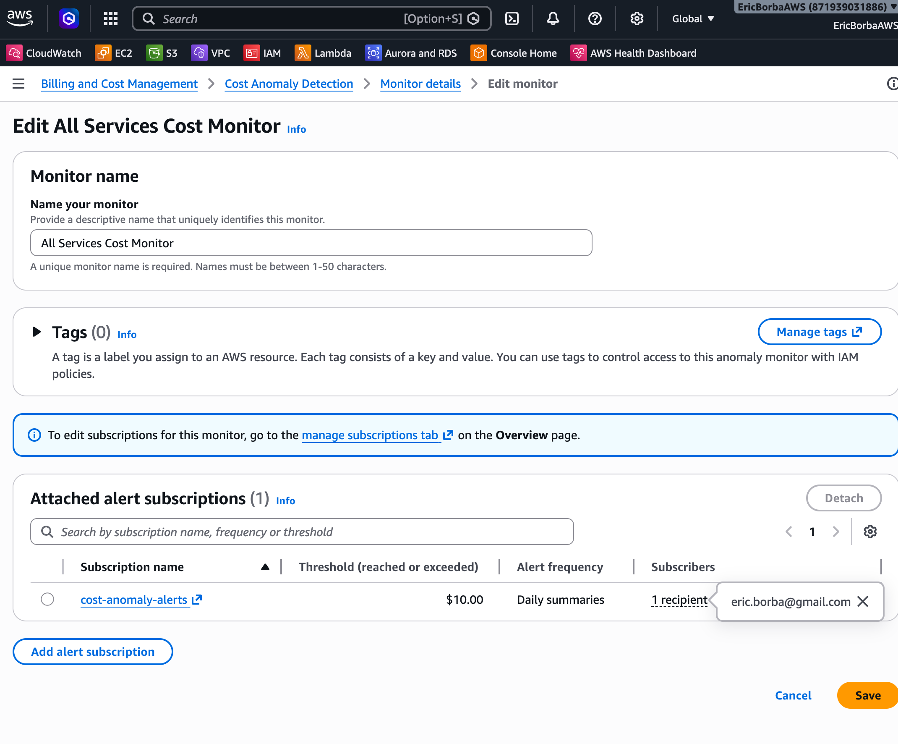

**Monitor name:** All Services Cost Monitor 

**Threshold:** $10

**SNS topic:** cost-anomaly-alerts

**Email confirmed:** ☐ Yes x No

---

### Service-Specific Monitor

**Screenshot 15: Service Monitor**


**Services monitored:**
- [ ] EC2
- [ ] S3
- [ ] RDS
- [ ] Other: ___________________________

"Selecting specific services is not possible aymore in aws while creating monitors"

---

## Part 8: Optimization Opportunities

### AWS Recommendations

**Screenshot 16: Optimization Recommendations**
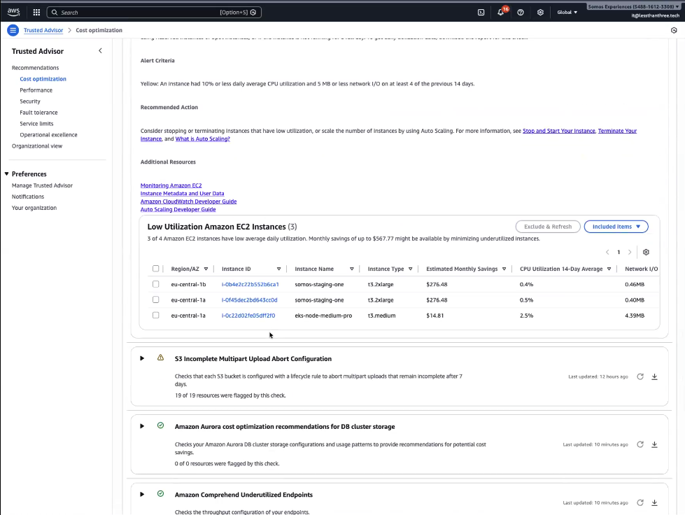

**Top 3 Recommendations:**

**1. Recommendation:**
```
Stop or terminate somos-staging-one (i-0b4e2c22b552b6ca1)
in eu-central-1b — t3.2xlarge with only 0.4% CPU utilization
```
- Potential savings: $276.48/month/month
- Effort to implement: ☐ Low x Medium ☐ High
- Will implement: ☐ Yes ☐ No x Maybe

**2. Recommendation:**
```
Stop or terminate somos-staging-one (i-0f45dec2bd643cc0d)
in eu-central-1a — t3.2xlarge with only 0.5% CPU utilization
```
- Potential savings: $276,48/month
- Effort to implement: ☐ Low x Medium ☐ High
- Will implement: ☐ Yes ☐ No x Maybe

**3. Recommendation:**
```
Downsize or stop eks-node-medium-pro (i-0c22d02fe05dff2f0)
in eu-central-1a — t3.medium with 2.5% CPU utilization
```
- Potential savings: $14,81/month
- Effort to implement: x Low ☐ Medium ☐ High
- Will implement: ☐ Yes ☐ No x Maybe

**Total potential savings:** $567,77/month

---

### Idle Resources Audit

**Screenshot 17: Idle Resources**
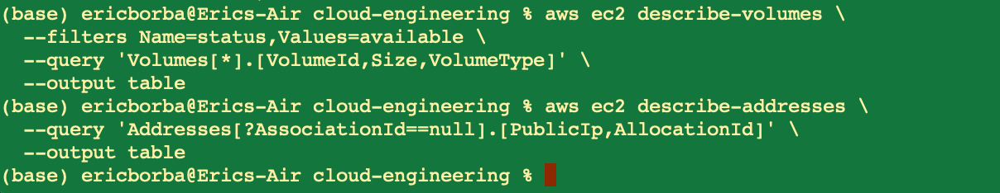

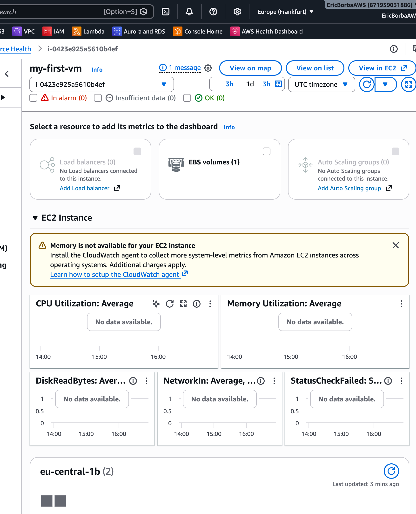

**Idle resources identified:**

**Unattached EBS Volumes:**
- Count: _____
- Total size: _____ GB
- Monthly cost: $_______________

**Unassociated Elastic IPs:**
- Count: _____
- Monthly cost: $_______________

**Stopped EC2 Instances (still incurring EBS costs):**
- Count: _____
- Monthly cost: $_______________

**Old Snapshots (>90 days):**
- Count: _____
- Total size: _____ GB
- Monthly cost: $_______________

**Total idle resource cost:** $_______________/month

"Not enough information to calculate indle resource costs. However, the step by step instructions of the lab were performed as it is possible to see on the pictures above."

---

### Reserved Instance Analysis

**Current On-Demand EC2 spend:** $0/month

**Consistently running instances:**
- Instance type: t3.micro
- Quantity: 1
- Hours/month: 16

| Term                    | Upfront  | Monthly | Total Annual           | Savings |
| ----------------------- | -------- | ------- | ---------------------- | ------- |
| On-Demand               | $0       | **$60** | **$720**               | 0%      |
| 1-Year, No Upfront      | $0       | **$40** | **$480**               | **33%** |
| 1-Year, Partial Upfront | **$150** | **$25** | **$450 + $150 = $600** | **17%** |
| 1-Year, All Upfront     | **$420** | $0      | **$420**               | **42%** |


**Recommendation:**
```
I am not running the instance long enough to be billed meaningfully because it is fully covered by the AWS Free Tier. In this case, Reserved Instances are not financially beneficial right now.
```

---

## Part 9: Cost Optimization Action Plan

### Current State Assessment

**Monthly average spend:** $520.94

**Top 3 cost drivers:**
1. Elastic Compute Cloud (EC2) — $89.24/month (~11.5% of bill)
2. Elastic Load Balancing — $39.58/month
3. Virtual Private Cloud (VPC) — $37.21/month

**Cost trend:** x Increasing ☐ Stable ☐ Decreasing

**If increasing, by how much?** ~15% over last 3 months
(based on October peak of ~$800 vs average of $520.94)

---

### Action Plan

**Quick Wins (Immediate - 0-1 week):**

**1.**
```
Action:  Stop or terminate somos-staging-one (i-0b4e2c22b552b6ca1)
in eu-central-1b — t3.2xlarge, 0.4% CPU utilization
Expected savings: $276.48/month
Owner: DevOps / Eric Rodrigues Borba
Deadline: 01/05/2026
```

**2.**
```
Action: Stop or terminate somos-staging-one (i-0f45dec2bd643cc0d)
in eu-central-1a — t3.2xlarge, 0.5% CPU utilization
Expected savings: $276.48/month
Owner: DevOps / Eric Rodrigues Borba
Deadline: 01/05/2026
```

**3.**
```
Action:Downsize or stop eks-node-medium-pro (i-0c22d02fe05dff2f0)
in eu-central-1a — t3.medium, 2.5% CPU utilization
Expected savings: $14.81/month
Owner:  DevOps / Eric Rodrigues Borba
Deadline: 01/05/2026
```

**Quick wins total savings:** $567.77/month

---

**Short-term (1-3 months):**

**1.**
```
Action: Consolidate workloads into fewer regions — currently spread
across 9+ regions/AZs. Migrate non-essential resources to
primary region (eu-central-1) to reduce cross-region
data transfer and VPC costs.
Expected savings: $20.00/month
Owner:  DevOps / Cloud Architecture Team
Deadline: 30/06/2026
```

**2.**
```
Action: Configure S3 Intelligent-Tiering or Lifecycle Policies
to automatically move infrequently accessed objects to
cheaper storage classes (Glacier).
Expected savings: $1.50/month
Owner: DevOps / Eric Rodrigues Borba
Deadline: 30/06/2026
```

**3.**
```
Action:  Complete cost allocation tagging across all resources
(Project, Team, Environment tags). Activate tags in
Cost Explorer to enable per-team/project billing visibility.
Expected savings: $0/month direct, but enables future waste identification
Owner: Eric Rodrigues Borba
Deadline:15/05/2026
```

**Short-term total savings:** $21.50/month

---

**Long-term (3-12 months):**

**1.**
```
Action: Evaluate Reserved Instances or Savings Plans for
consistently running EC2 instances. A 1-year All Upfront
RI can save up to 42% vs On-Demand for stable workloads.
Expected savings: $30.00/month
Owner: Cloud Finance / DevOps Lead
Deadline: 01/10/2026
```

**2.**
```
Action:  Implement Auto Scaling for EC2 workloads to automatically
scale down during off-peak hours (nights/weekends),
eliminating idle compute costs.
Expected savings: $25.00/month
Owner: DevOps / Engineering Team
Deadline: 01/10/2026
```

**3.**
```
Action: Review and clean up Elastic Load Balancer usage —
currently the 2nd highest cost driver at $39.58/month.
Remove unused load balancers and consolidate where possible.
Expected savings: $15.00/month
Owner: DevOps / Eric Rodrigues Borba
Deadline: 01/01/2027
```

**Long-term total savings:** $70.00/month

---

### Savings Summary

| Timeframe   | Total Savings/Month | Annual Impact  |
|-------------|---------------------|----------------|
| Quick Wins  | $567.77             | $6,813.24      |
| Short-term  | $21.50              | $258.00        |
| Long-term   | $70.00              | $840.00        |
| **TOTAL**   | **$659.27**         | **$7,911.24**  |

**Percentage reduction:** 126% of current spend

---

## Part 10: Stakeholder Report

### Report Export

**Screenshot 18: Exported Report**
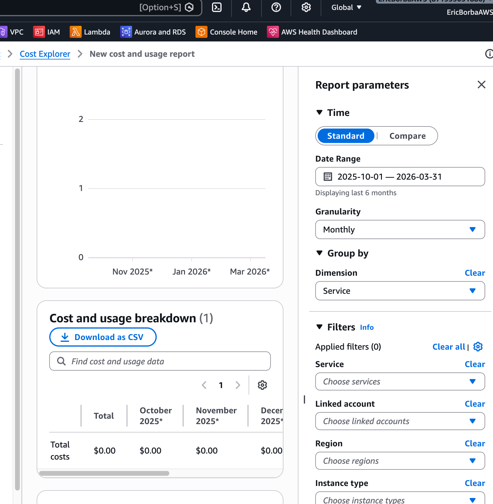

**Report format:** x CSV ☐ PNG ☐ PDF ☐ All

**Stakeholder Report**: 

[Full StakeHolder Report](AWS_Cost_Optimization_Report_Eric_Borba.md)

**Report includes:**
- [x] Executive summary
- [x] Cost trend charts
- [x] Top cost drivers
- [x] Optimization recommendations
- [x] Action plan with ROI

---

## Reflection Questions

### 1. How often should you review Cost Explorer, and why?

**Your answer:**
```
I think checking it at least once or twice a week makes sense for most setups, but daily if you're running something critical or just made infrastructure changes.
The whole point is catching surprises early before a small spike turns into a big bill.
```

### 2. Why are cost allocation tags important for enterprise AWS accounts?

**Your answer:**
```
Without tags, you just see a total bill with no idea which team, project or service is actually responsible for the cost. Tags let you slice that bill and say "this $800 spike came from the data pipeline team's resources in production" instead of guessing.
```

### 3. Describe the trade-offs between Reserved Instances and On-Demand.

**Your answer:**
```
On-Demand is flexible and you only pay for what you use, but that freedom comes at full price. Reserved Instances can save you up to 42% but you're committing upfront
for 1 or 3 years, so if your needs change or you shut down that instance, you've already paid and there's no refund.
```

### 4. What is the value of Cost Anomaly Detection?

**Your answer:**
```
It monitors your spending automatically and sends you an alert the moment something looks off, like a service suddenly costing 3x more than usual. Without it you'd only
notice the damage at the end of the month when the bill arrives and it's already too late.
```

### 5. How would you present cost optimization findings to non-technical stakeholders?

**Your answer:**
```
I would skip the instance names and region codes and just say something like "we found that 60% of our compute spend was sitting idle, and by turning off two unused servers we can save $567 a month without any impact on performance or users."
```

---

## Self-Assessment

**Rate your confidence (1-5):**

| Skill | Before Lab | After Lab | Growth |
|-------|-----------|-----------|--------|
| Using Cost Explorer | 1/5 | 3/5 | +___ |
| Analyzing cost trends | 1/5 | 4/5 | +___ |
| Cost allocation tags | 1/5 | 3/5 | +___ |
| Identifying optimizations | 1/5 | 3/5 | +___ |
| Reserved Instance planning | 1/5 | 4/5 | +___ |
| Cost reporting | 1/5 | 4/5 | +___ |
| Anomaly detection | 1/5 | 3/5 | +___ |

---

## Instructor Verification

**Instructor Name:** ___________________________

**Date Reviewed:** ___________________________

**All reports completed:** ☐ Yes ☐ No

**Action plan realistic:** ☐ Yes ☐ No

**Comments:**
```
_____________________________________________________________
_____________________________________________________________
_____________________________________________________________
```

**Grade/Status:** ___________________________

---

**Lab Status:** ☐ Complete ☐ Needs Revision

**Submission Date:** ___________________________
